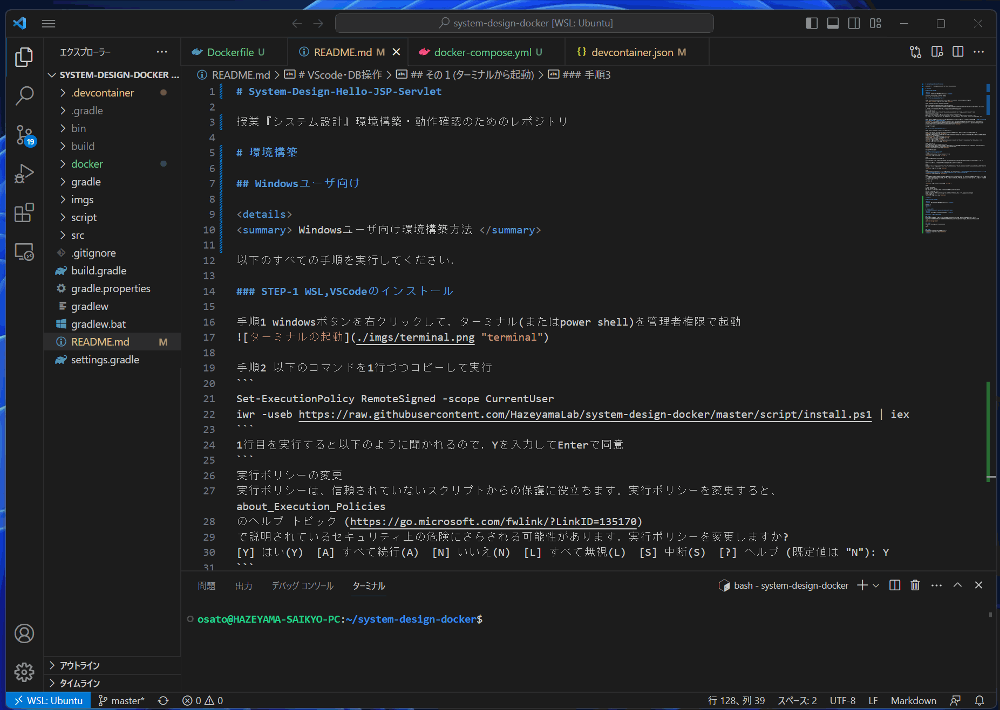
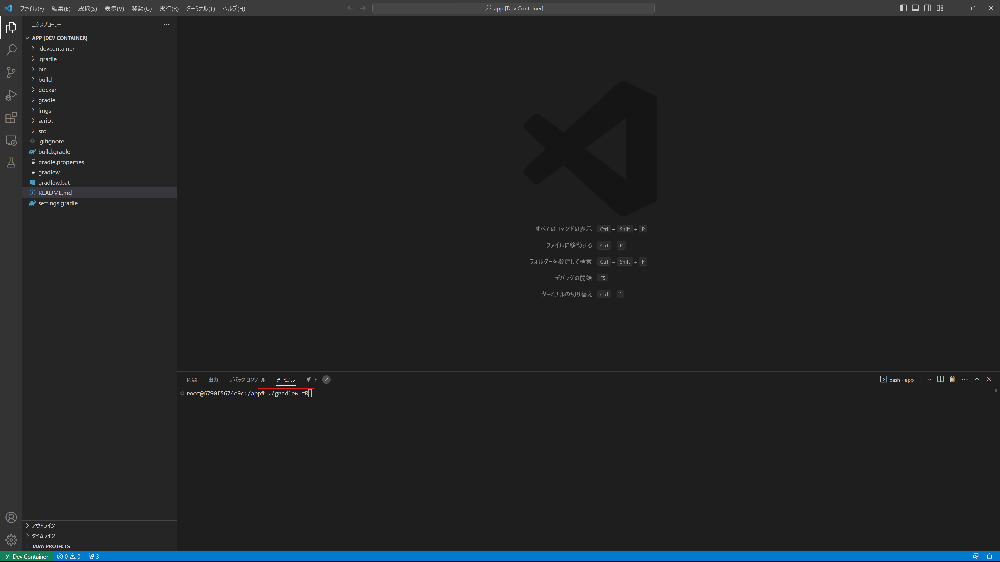
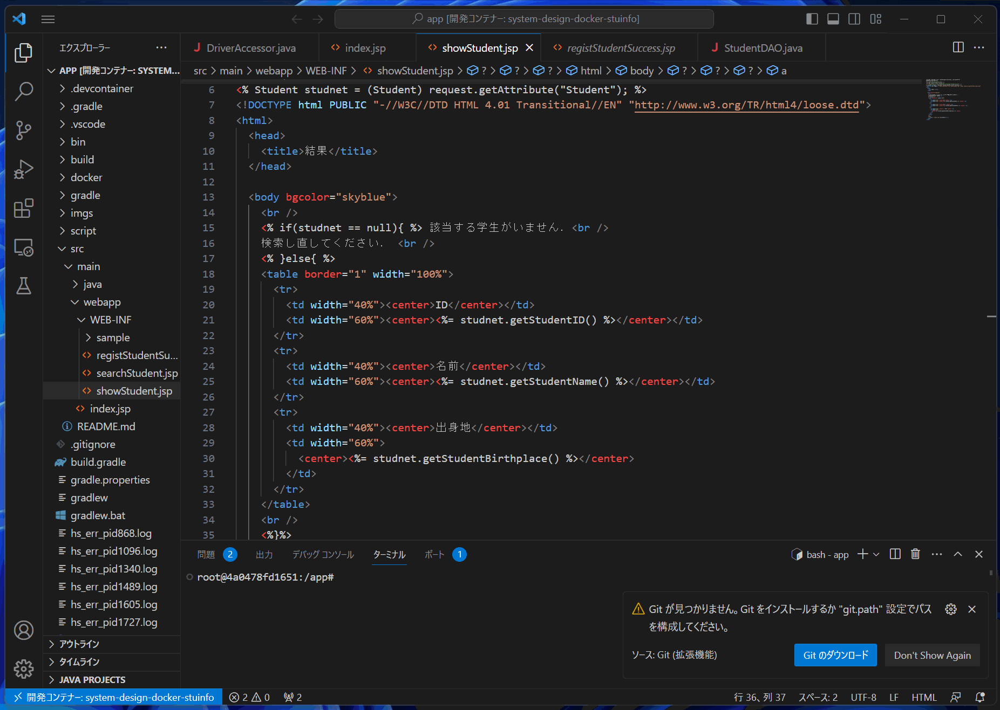
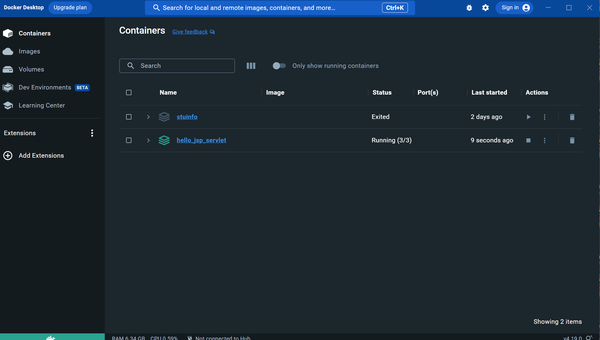
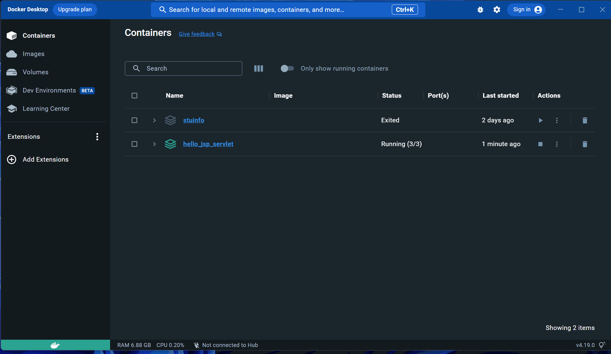
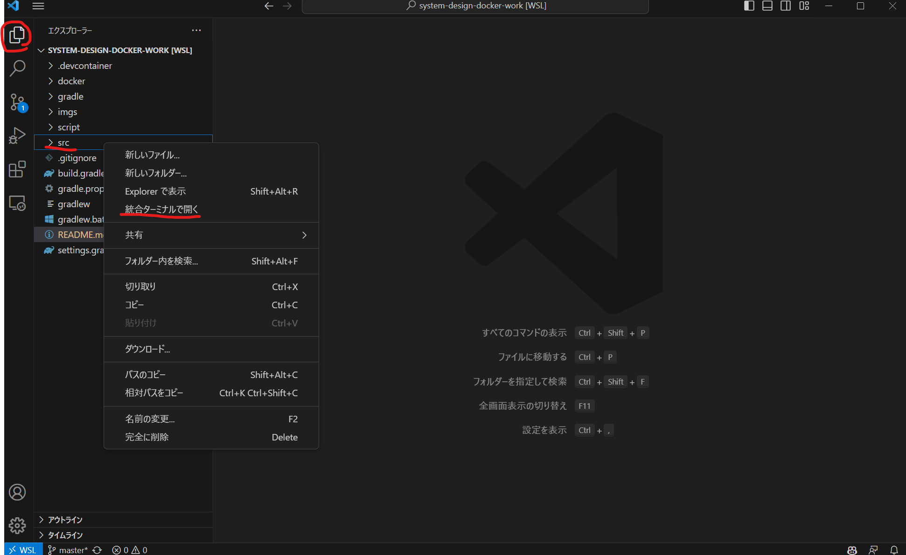
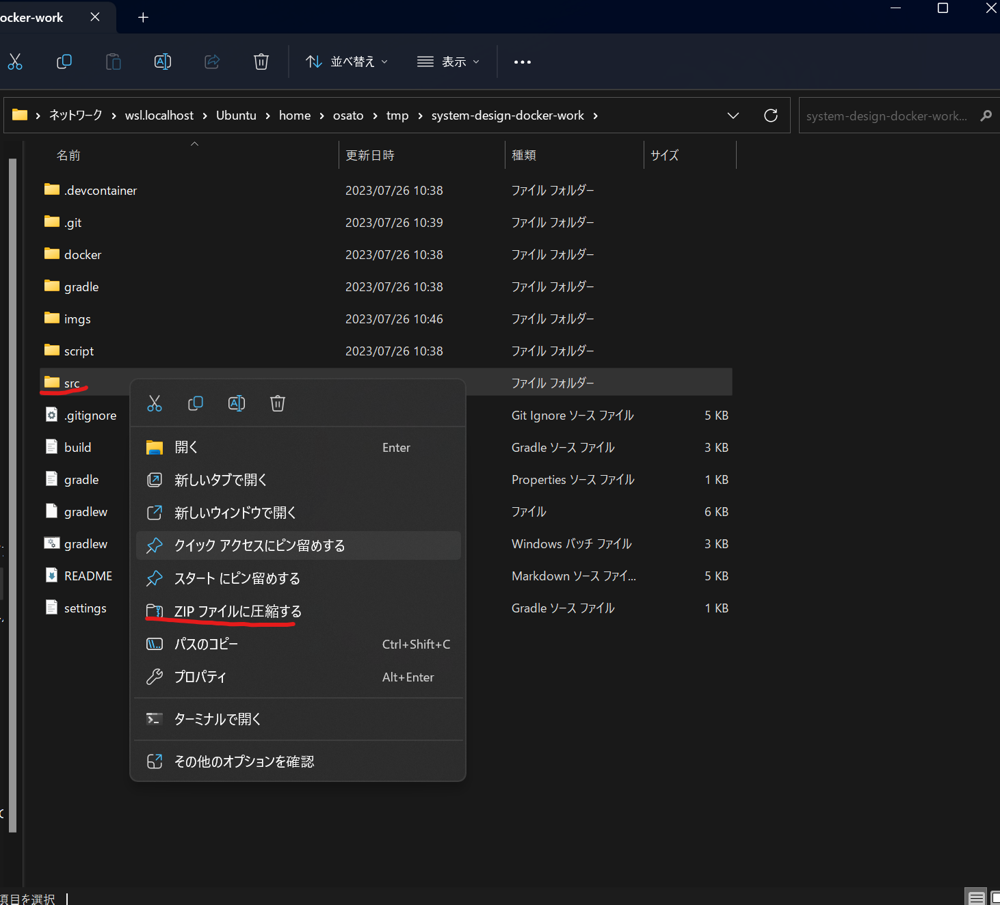
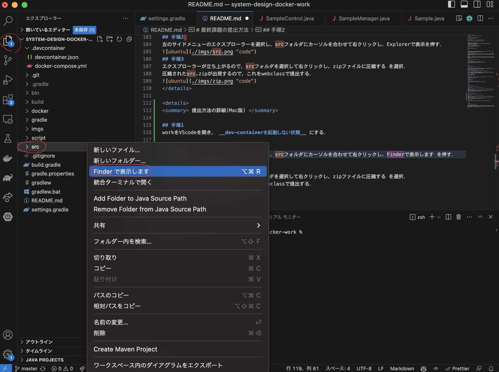
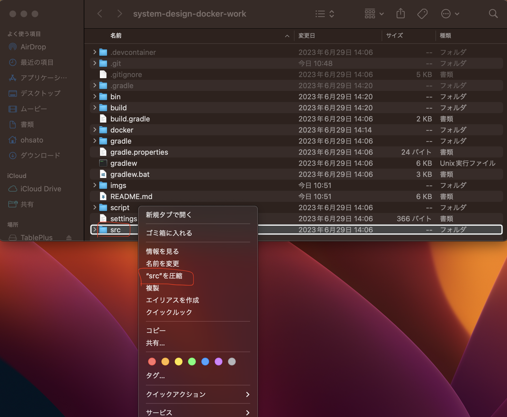

# System-Design-Docker-Work

授業『システム設計』 最終課題用テンプレートのレポジトリ

# 課題の進め方
<details>
<summary> VScodeでプロジェクトを開く方法 </summary>

## ターミナルから起動する手法

### 初回のみの設定
Ubuntu(Win)もしくはターミナル(mac)を起動し，以下のコマンドを実行する
```sh
git clone https://github.com/HazeyamaLab/system-design-docker-work.git
```

### 手順1
Docker Desktopを事前に起動したうえで，
Ubuntu(Win)もしくはターミナル(mac)を起動し，以下のコマンドを実行し課題プロジェクトを開く．
|  プロジェクト名  |  ディレクトリ名  |
| ---- | ---- |
|  動作確認  |  system-design-docker  |
|  stuinfo  |  system-design-docker-stuinfo  |
|  課題用テンプレート  |  system-design-docker-work  |
```sh
cd system-design-docker-work
```
### 手順2
以下のコマンドを実行してVScodeを起動
```sh
code .
```

### 手順3
VScodeをdev-containerで再度開く．右下のウインドウからReopen in containerを選択するか，Ctrl + Shift + pでコマンドパレットを開き，Reopen in Container を入力して選択する(gif参照)


### 手順４
アプリケーションのソースコードを記入する．アプリケーションのソースコードは src/main/ 配下に記入する．新しいjavaファイルを作成する場合は，作成したいパッケージ(control, dao, model, servlet)のフォルダをクリックし，New fileを押して拡張子.javaでファイルを作成する．

### 手順５
手順5  
画面下部ターミナルで以下のコマンドを実行．もしターミナルが表示されていなければ，上部メニューバーの ターミナル -> 新しいターミナル で出現する．暫く待ったあと，ブラウザで http://localhost:8080/system-design-dev/ を開くとアプリケーションが操作できる．
```
./gradlew tR
```
  

## VScodeから起動する手法

VScodeを起動し，ファイル ->  最近使用した項目を開く<br>
[dev container:system-design-docker-work]等の開きたい項目をクリックするだけ


</details>

<br>

# MySQL
## データベースの操作方法
<details>
<summary> Dockerのデータベースを操作する方法 </summary>

### 前提
VScode を立ち上げて，dev-containerが立ち上がっている状態であること Docker Desktopを起動して下の画像のように，対象のStack(3つ座布団が重なっているようなアイコン)が緑色になっていればOK


### 手順1 Docker Desktopを起動する
もしdev-containerが立ち上がっていない場合は，VScodeの操作方法 -> 手順3を実行すること

### 手順2 対象のStackからhogehoge-dbというコンテナを開く
今回システム設計では3つのStackを配布するので，DB操作を行いたいプロジェクト(最終課題の場合はwork)を選択して， __末尾が-dbとなっているコンテナを選択__ して，Terminalを開く 詳細はGif参照


### 手順3 MySQLを起動する
以下のコマンドをTerminal上で実行
```
mysql -uroot -p
```
Enter password:と表示されてパスワード入力が求められるので，test と入力．__パスワードは入力しても画面上に表示されないので要注意！__ <br>
尚，今回用いるDBの基本情報は以下の通り
|    |    |
| ---- | ---- |
|  ユーザ名  |  root  |
|  パスワード  |  root  |
|  DB名  |  db  |

### 手順4 MySQLが立ち上がったら，任意の操作を行う．
以下のコマンドを入力して，データベースを選択した後，任意の操作が行える．
```
use db;
```
</details>
<br>

# 最終課題の提出方法
<details>
<summary> 提出方法の詳細(Win版) </summary>

## 手順1
workをVScodeを開き， __dev-containerを起動しない状態__ にする．

## 手順2 
左のサイドメニューのエクスプローラーを選択し，srcフォルダにカーソルを合わせて右クリックし，Explorerで表示を押す．

## 手順3
エクスプローラーが立ち上がるので，srcフォルダを選択して右クリックし，zipファイルに圧縮する を選択．
圧縮されたsrc.zipが出現するので，これをwebclassで提出する．

</details>

<details>
<summary> 提出方法の詳細(Mac版) </summary>

## 手順1
workをVScodeを開き， __dev-containerを起動しない状態__ にする．

## 手順2 
左のサイドメニューのエクスプローラーを選択し，srcフォルダにカーソルを合わせて右クリックし，Finderで表示します を押す．

## 手順3
Finderが立ち上がるので，srcフォルダを選択して右クリックし，"src"を圧縮 を選択．
圧縮されたsrc.zipが出現するので，これをwebclassで提出する．

</details>

# 質問やバグ報告等
開発上で困ったことがあったらm228112p [@] st.u-gakugei.ac.jpまでTeams等で連絡してください．

<br>


# よくある質問
<details>
<summary> 今までの質問と回答 </summary>

### StuinfoとWorkを同時に開きたい
今回の環境は異なるプロジェクトを同時に起動することはできないので，workのプロジェクトを起動したまま，stuinfoなどのプロジェクトのソースコードを見たい場合には，stuinfoのプロジェクトを開くときに，dev-containerで開かないようにする．そうするとアプリは起動しないが，ソースコードは閲覧できる．


</details>