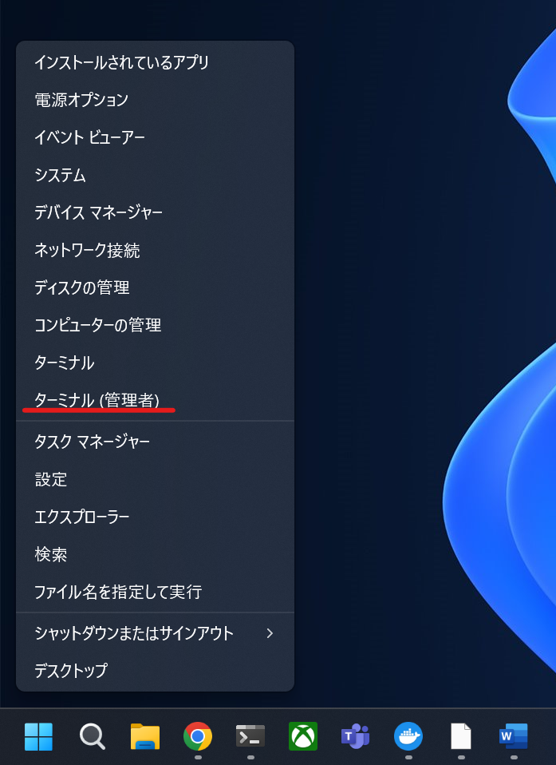
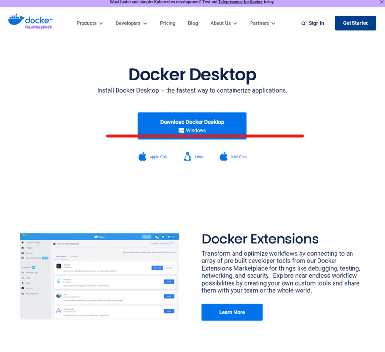
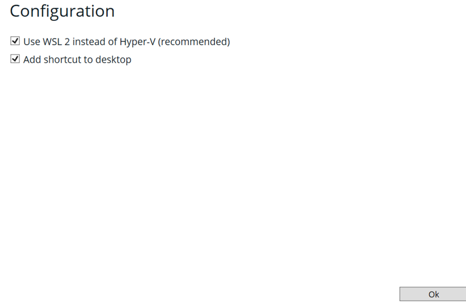
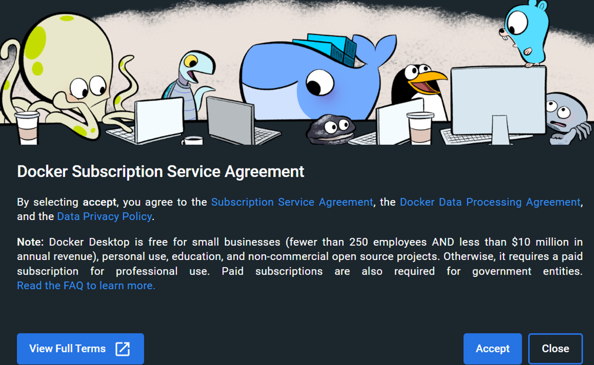
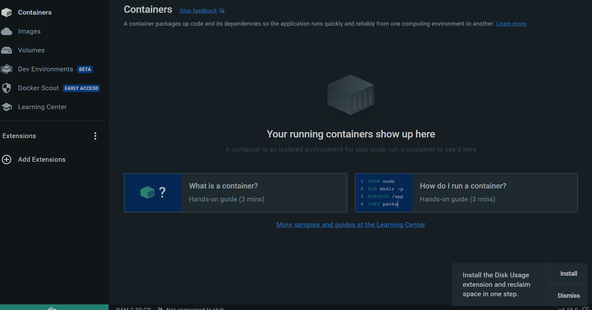
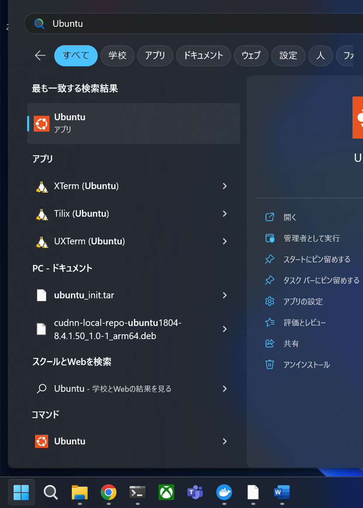
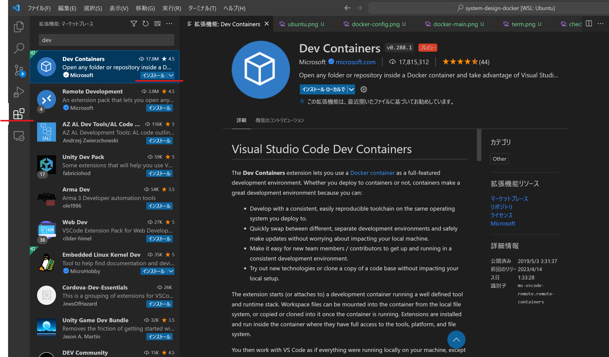
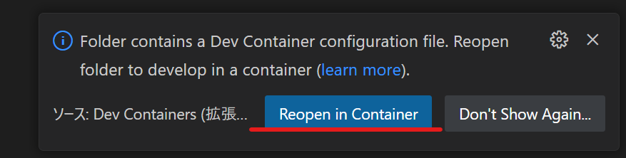
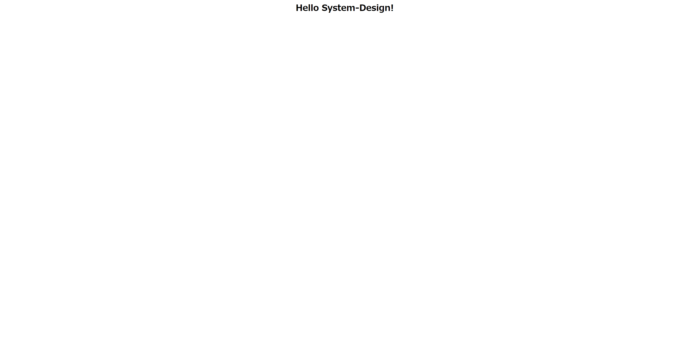

# System-Design-Hello-JSP-Servlet

授業『システム設計』環境構築・動作確認のためのレポジトリ

# 環境構築

## Windowsユーザ向け

<details>
<summary> Windowsユーザ向け環境構築方法 </summary>

以下のすべての手順を実行してください．

### STEP-1 WSL,VSCodeのインストール

手順1 windowsボタンを右クリックして，ターミナル(またはpower shell)を管理者権限で起動


手順2 以下のコマンドを1行づつコピーして実行
```
Set-ExecutionPolicy RemoteSigned -scope CurrentUser
iwr -useb https://raw.githubusercontent.com/HazeyamaLab/system-design-docker/master/script/install.ps1 | iex
```
1行目を実行すると以下のように聞かれるので，Yを入力してEnterで同意  
```
実行ポリシーの変更
実行ポリシーは、信頼されていないスクリプトからの保護に役立ちます。実行ポリシーを変更すると、about_Execution_Policies
のヘルプ トピック (https://go.microsoft.com/fwlink/?LinkID=135170)
で説明されているセキュリティ上の危険にさらされる可能性があります。実行ポリシーを変更しますか?
[Y] はい(Y)  [A] すべて続行(A)  [N] いいえ(N)  [L] すべて無視(L)  [S] 中断(S)  [?] ヘルプ (既定値は "N"): Y
```

手順3 Ubuntu というCLIが立ち上がり，ユーザ名とパスワードの設定が求められるので設定．このとき __パスワードは入力しても画面上に表示されないので要注意！__


以上でSTEP-1完了．

### STEP-2 Docker-Desktopのインストール
  
手順1 Docker Desktopのダウンロード・インストール
  
https://www.docker.com/products/docker-desktop/ にアクセス，ダウンロードしたexeファイルを実行．
  
チェックボックスはどちらもチェックが入っていることを確認．（バージョンによってはチェックボックスが1つしかないこともあるが，それでも大丈夫） 
  
規約に同意したらAcceptボタンでインストール．
  
インストールできたらDocker-Desktopを起動し，チュートリアルをスキップすると，このようなメイン画面が出現．
  
  
手順2 Dockerの設定  
WSL上でDockerが動作するように設定する．
Docker-Desktopのメイン画面左上の矢印マークを押して設定画面を開き，右側のResourcesタブからWSL integrationを選択し，Ubuntuのチェックを入れて右下のApply & restartを押下．
  

以上でSTEP-2は完了．

### STEP-3 Ubuntu上での環境整備  
  手順1
Ubuntuを起動し，CLIが立ち上がるのを確認する．
  
  
手順2
Ubuntu CLIで以下のコマンドを実行．
```
curl -sf https://raw.githubusercontent.com/HazeyamaLab/system-design-docker/master/script/setup.sh | sh -s
```
パスワードが求められるので．STEP-1 手順3で入力したパスワードを入力．
  
手順3
VSCodeが立ち上がるので，左のテトリスのようなアイコンを選択し，Dev Containerの拡張機能を検索欄から検索してインストール．
  
  
手順4
右下に以下のようなWindowが出現するので，Reopen in Containerを選択 __このとき8080，8081，3307のポートが使われていると正常に起動しない，特にローカルにMySQLがインストールされている場合は要注意__
 
もしこのwindowが出現しなかった場合は，以下のGifの手順をたどる

  
手順5  
初回起動時は特に時間がかかるのでしばらく待機．その後，右下のStarting Dev Containerのウインドウが閉じた後，画面下部ターミナルで以下のコマンドを実行．もしターミナルが表示されていなければ，上部メニューバーの ターミナル -> 新しいターミナル で出現する．
```
./gradlew tR
```
  
  
手順6  
```
> Task :tomcatRun
Started Tomcat Server
The Server is running at http://localhost:8080/system-design-dev
```
以上の出力を確認した後，
http://localhost:8080/system-design-dev にアクセスし下の画面が出現すれば環境構築は終了．
お疲れ様でした．


</details>

## Macintoshユーザ向け

<details>
<summary> Macintoshユーザ向け環境構築方法 </summary>

後で書きます
</details>
<br>

# VScodeの操作
## 基礎的なVScodeの操作方法
<details>
<summary> VScodeでプロジェクトを開く方法 </summary>

## その１(ターミナルから起動)

### 手順1
Ubuntu(Win)もしくはターミナル(mac)を起動し，以下のコマンドを実行してプロジェクトフォルダに移る
Stuinfoプロジェクトや課題プロジェクトを開く場合はsystem-design-dockerのディレクトリ名部分を適宜修正
|  プロジェクト名  |  ディレクトリ名  |
| ---- | ---- |
|  動作確認  |  system-design-docker  |
|  stuinfo  |  system-design-docker-stuinfo  |
|  課題用テンプレート  |  system-design-docker-your-project  |
```sh
cd system-design-docker
```
### 手順2
以下のコマンドを実行してVScodeを起動
```sh
code .
```

### 手順3
VScodeをdev-containerで再度開く
<br>
VScode起動後，Ctrl + Shift + pでコマンドパレットを開き，reopen in containerと検索するとDev:Container Reopen in Containerの選択肢が出てくるので，それを選択する．
VScodeのWindowが再起動したらOK
(gif参照)


### 手順4
手順5  
画面下部ターミナルで以下のコマンドを実行．もしターミナルが表示されていなければ，上部メニューバーの ターミナル -> 新しいターミナル で出現する．
```
./gradlew tR
```
  

## その2(こっちのほうが楽です)

VScodeを起動し，ファイル ->  最近使用した項目を開く<br>
[dev container:system-design-docker]等の開きたい項目をクリックするだけ


</details>

<br>

# MySQL
## データベースの操作方法
<details>
<summary> Dockerのデータベースを操作する方法 </summary>

### 前提
VScode を立ち上げて，dev-containerが立ち上がっている状態であること Docker Desktopを起動して下の画像のように，対象のStack(3つ座布団が重なっているようなアイコン)が緑色になっていればOK
  

### 手順1 Docker Desktopを起動する
もしdev-containerが立ち上がっていない場合は，VScodeの操作方法 -> 手順3を実行すること

### 手順2 対象のStackからhogehoge-dbというコンテナを開く
今回システム設計では3つのStack(hello_jsp_servlet / stuinfo / your_project)を配布するので，DB操作を行いたいプロジェクトを選択して， __末尾が-dbとなっているコンテナを選択__ して，Terminalを開く 詳細はGif参照


### 手順3 MySQLを起動する
以下のコマンドをTerminal上で実行
```
mysql -utest -p
```
Enter password:と表示されてパスワード入力が求められるので，test と入力．__パスワードは入力しても画面上に表示されないので要注意！__ <br>
尚，今回用いるDBの基本情報は以下の通り
|    |    |
| ---- | ---- |
|  ユーザ名  |  test  |
|  パスワード  |  test  |
|  DB名  |  db  |

### 手順4 MySQLが立ち上がったら，任意の操作を行う．
以下のコマンドを入力して，データベースを選択した後，任意の操作が行える．
```
use db;
```


</details>