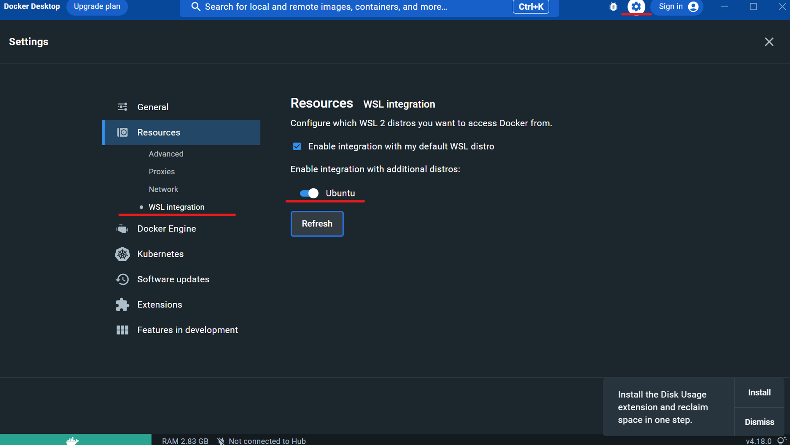

# System-Design-Docker

授業『システム設計』環境構築のためのレポジトリ

## Windowsユーザ向け環境構築方法
以下のすべての手順を実行してください．

### STEP-1 WSL,VSCodeのインストール

手順1 windowsボタンを右クリックして，ターミナル(またはpower shell)を管理者権限で起動


手順2 以下のコマンドを1行づつコピーして実行
```
Set-ExecutionPolicy RemoteSigned -scope CurrentUser
iwr -useb https://raw.githubusercontent.com/HazeyamaLab/system-design-docker/master/script/install.ps1 | iex
```

手順3 Ubuntu というCLIが立ち上がり，ユーザ名とパスワードの設定が求められるので設定．このとき __パスワードは入力しても画面上に表示されないので要注意！__


以上でSTEP-1完了．

### STEP-2 Docker-Desktopのインストール
  
手順1 Docker Desktopのダウンロード・インストール
  
https://www.docker.com/products/docker-desktop/ にアクセス，ダウンロード．
  
チェックボックスはどちらもチェックが入っていることを確認． 
  
規約に同意したらAcceptボタンでインストール．
  
チュートリアルをスキップすると，このようなメイン画面が出現．
  
  
手順2 Dockerの設定  
WSL上でDockerが動作するように設定する．
Docker-Desktopのメイン画面左上の矢印マークを押して設定画面を開き，右側のResourcesタブからWSL integrationを選択し，Ubuntuのチェックを入れてRefreshを押下．
  

以上でSTEP-2は完了．

### STEP-3 Ubuntu上での環境整備  
  手順1
Ubuntuを起動し，CLIが立ち上がるのを確認する．
  
  
手順2
Ubuntu CLIで以下のコマンドを実行．
```
curl -sf https://raw.githubusercontent.com/HazeyamaLab/system-design-docker/master/script/setup.sh | sh -s
```
パスワードが求められるので．STEP-1 手順3で入力したパスワードを入力．
  
手順3
VSCodeが立ち上がるので，左のテトリスのようなアイコンを選択し，Dev Containerの拡張機能を検索欄から検索してインストール．
  
  
手順4
右下に以下のようなWindowが出現するので，Reopen in Containerを選択 __このとき8080，8081，3307のポートが使われていると正常に起動しない，特にローカルにMySQLがインストールされている場合は要注意__
  
  
手順5  
初回起動時は特に時間がかかるのでしばらく待機．その後，画面下部ターミナルで以下のコマンドを実行．もしターミナルが表示されていなければ，上部メニューバーの ターミナル -> 新しいターミナル で出現する．
```
./gradlew tR
```
  
  
手順6  
```
> Task :tomcatRun
Started Tomcat Server
The Server is running at http://localhost:8080/system-design-dev
```
以上の出力を確認した後，
http://localhost:8080/system-design-dev にアクセスし下の画面が出現すれば環境構築は終了．
お疲れ様でした．
